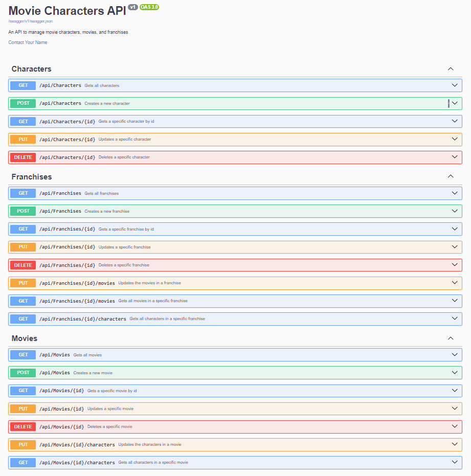

# Movie Characters API

A Web API built with ASP.NET Core for managing movie characters, movies, and franchises. The API allows you to track characters across different movies and movie franchises.

## Getting Started

These instructions will help you get a copy of the project up and running on your local machine for development and testing purposes.

### Prerequisites

- Visual Studio 2022
- .NET 6.0 SDK
- SQL Server Express
- SQL Server Management Studio (SSMS) - Recommended for database management

### First Time Setup

1. **Clone the Repository**
   ```bash
   git clone [your-repository-url]
   cd MovieCharactersAPI
   ```

2. **Check Database Connection String**
   - Open `appsettings.json`
   - Verify the connection string matches your SQL Server instance:
   ```json
   "ConnectionStrings": {
     "DefaultConnection": "Server=localhost\\SQLEXPRESS;Database=MovieCharactersDb;Trusted_Connection=True;TrustServerCertificate=True"
   }
   ```

3. **Create Initial Database**
   - Open Package Manager Console in Visual Studio (Tools → NuGet Package Manager → Package Manager Console)
   - Run the following commands:
   ```powershell
   Add-Migration InitialCreate
   Update-Database
   ```

4. **Run the Application**
   - Start the application in Visual Studio (F5 or press the "Play" button)
   - The database will be seeded with initial data on the first run
   - Swagger UI will open automatically at `http://localhost:5000/swagger`

### Demo


### Initial Data (Seeding)

On first run, the database will be seeded with:
- Two franchises:
  * Marvel Cinematic Universe
  * The Lord of the Rings
- Several characters:
  * Tony Stark (Iron Man)
  * Thor Odinson
  * Frodo Baggins
  * Gandalf
  * Aragorn
  * Legolas
  * Samwise Gamgee
- Four movies:
  * Iron Man
  * The Lord of the Rings trilogy:
    - The Fellowship of the Ring
    - The Two Towers
    - The Return of the King

## API Documentation

Once running, you can access the Swagger documentation at:
- http://localhost:5000/swagger

This provides a complete API reference with examples and the ability to test endpoints directly.

## Built With

- ASP.NET Core 6.0
- Entity Framework Core
- SQL Server
- AutoMapper
- Swagger/OpenAPI

## Project Structure

- `Controllers/` - API endpoints
- `Models/` - Database entities
- `DTOs/` - Data Transfer Objects
- `Data/` - DbContext and database configuration
- `Services/` - Business logic
- `Middleware/` - Custom middleware (error handling, etc.)

## Development Notes

- HTTP is used instead of HTTPS for development simplicity
- The database is automatically created and seeded on first run
- Swagger UI is enabled in development mode
- Custom error handling is implemented

## Entity Relationships

- Characters can appear in multiple movies (many-to-many)
- Movies can belong to one franchise (many-to-one)
- Franchises can have multiple movies (one-to-many)

## Authors

- [Your Name]

## License

This project is licensed under the MIT License - see the [LICENSE](LICENSE) file for details
